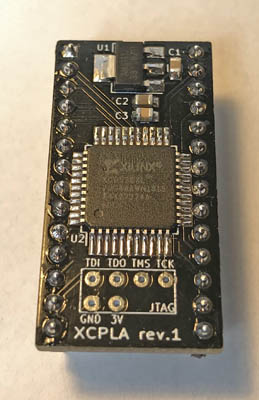

# PLA replacement for the C64

## Schenk program JEDEC using xc3sprog and Digilent JTAG-HS3 Rev. A

### Install xc3sprog

```
sudo apt install xc3sprog
```

### Program
Apply +5V power to the board

```
cd /work/electronic-projects/retro/c64-dodgypla/hdl/v1
xc3sprog -c jtaghs2 -J 1000000 -p 0 -v dodgypla.jed
```


## Schenk program JEDEC using openFPGALoader and Digilent JTAG-HS3 Rev. A

### Build openFPGALoader from sources
#### Install dependencies to build openFPGALoader
```
sudo apt install \
  git \
  gzip \
  libftdi1-2 \
  libftdi1-dev \
  libhidapi-hidraw0 \
  libhidapi-dev \
  libudev-dev \
  zlib1g-dev \
  cmake \
  pkg-config \
  make \
  g++
```

#### Build and install openFPGALoader (tag v0.13.1)
As tag (v0.13.1) use latest official
```
cd /work
git clone https://github.com/trabucayre/openFPGALoader
cd openFPGALoader
git checkout v0.13.1
mkdir build
cd build
cmake ..
cmake --build .
sudo make install
```

#### Prepare udev
```
cd /work/openFPGALoader
sudo cp 99-openfpgaloader.rules /etc/udev/rules.d/
sudo udevadm control --reload-rules && sudo udevadm trigger # force udev to take new rule
sudo usermod -a $USER -G plugdev # add user to plugdev group
```

### Program with openFPGALoader
```
cd /work/electronic-projects/retro/c64-dodgypla/hdl/v1
openFPGALoader -c digilent_hs3 --freq 1000000 -v dodgypla.jed
```


## XCPLA


The XCPLA is a replacement for the PLA in older versions of the Commodore 64. It is my rendition of the [DodgyPLA by desater](https://github.com/desaster/c64-dodgypla) (see below). While the original version is made for self-etching, the XCPLA layout is optimized for professional board manufacturers.

There are two different versions of the compiled firmware provided in the [`build/`](./build/) directory, both as JED and SVF files. The first one is called `xcpla-dodgy` and contains the exact same core as the originial DodgyPLA project. The other one is called `xcpla-neat` and it uses the modified core from the [neatPLA project][3]. This core implements different output delays that seem to [fix issues][4] some pepole have been experiencing on certain mainboards. Both versions can be programmed onto the XCPLA.

More information can be found in my [blog post](https://www.hackup.net/2019/05/the-xcpla-yet-another-pla-replacement/).

In hindsight, it would have been better to create a new repository for the XCPLA. But somehow I failed to do so in time, so here we are.

There is no warranty whatsoever. **USE AT YOUR OWN RISK!**.

## DodgyPLA


Based on the work by skoe:

[https://bitbucket.org/skoe/pla](1)
[http://skoe.de/docs/c64-dissected/pla/c64_pla_dissected_a4ds.pdf](2)

This design uses the Xilinx XC9536XL, which has 5V tolerant inputs essential
for operation with the Commodore 64.

As opposed to skoe's design, the required CASRAM delay is implemented in
Verilog instead of using additional components.

This project includes:

* A Xilinx ISE project written in Verilog for Xilinx XC9536XL
* A KiCad project including a board designed for home etching

[3]: https://github.com/1c3d1v3r/neatPLA
[4]: https://github.com/desaster/c64-dodgypla/issues/4
