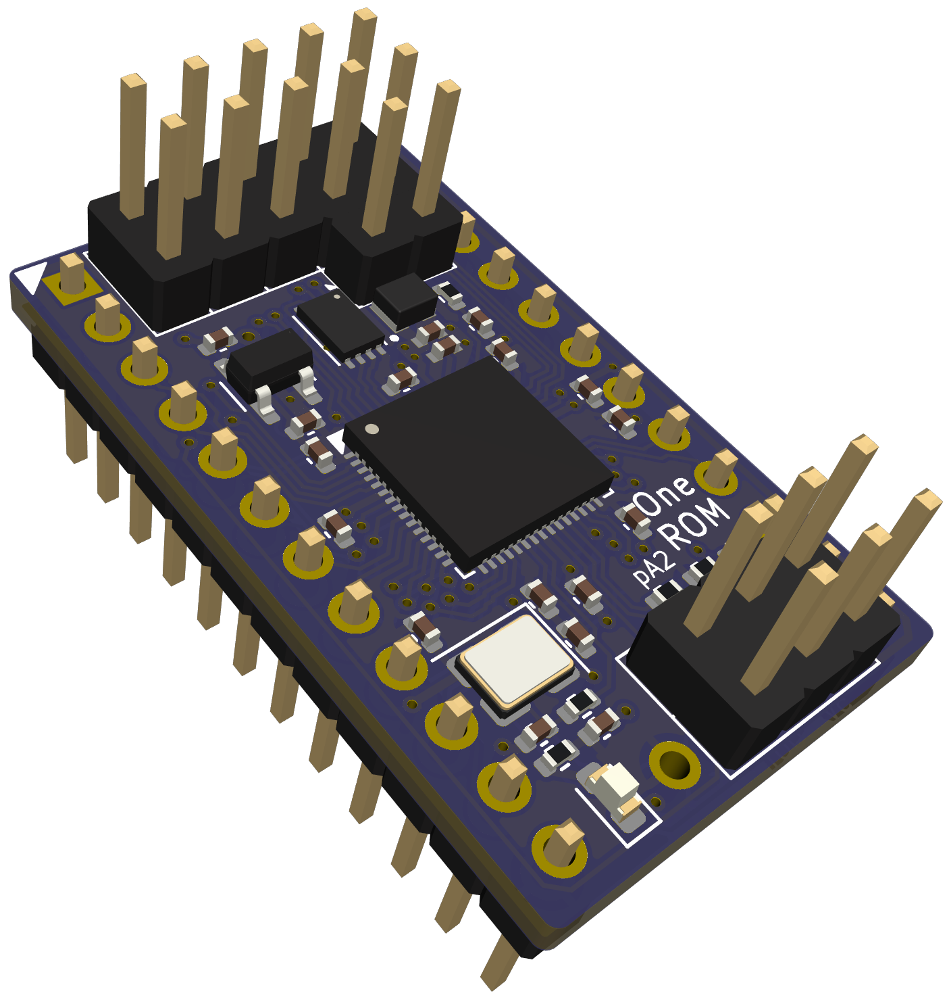

# One ROM

**[One ROM](https://onerom.org) - One ROM To Rule Them All**

The most flexible ROM replacement for your retro computer.  It is highly configurable and low-cost.  Get them fabbed at JLC for under $5 each in a quantity of 10 or more.

Based on a Raspberry Pi RP2350 (One ROM Fire 🔥) or STM32F4 (One ROM Ice ❄️).

One ROM emulates any system's 2364, 2332 and 2316 ROMs, with any chip select configuration, and can serve different images to multiple ROM sockets simultaneously.

Replaces failed ROMs in Commodore 64s, VIC-20s, PETs, disk drives and another brands of retro systems, including Atari, TI, etc.

One ROM was formerly known as Software Defined Retro ROM (SDRR).

## Key Features

💰 Based on sub-$2 microcontrollers.  **[Choose from Raspberry Pi (Fire 🔥) or STM (Ice ❄️) flavours](docs/MCU-SELECTION.md)**.

⚡ **[Fast](docs/STM32-SELECTION.md)** enough for PETs, VIC-20s, C64s, 1541s, IEEE drives, etc. Support faster systems with higher end microcontroller.

📐 **[Same footprint](docs/images/sdrr-24-pin-side.png)** as original ROMs - doesn't overhang the socket like other solutions.

🔌 **[USB Version](https://onerom.org/prog/)** - no programmer required, program from your browser.

🚀 **[Quick programming](docs/PROGRAMMING.md)** - build and flash in <10 seconds.

🛠️ **[Reflash in situ](docs/PROGRAMMING.md)** - no need to remove the ROM from the host when reprogramming.

⚙️ **[Software configurable](docs/CONFIGURATION.md)** chip select lines - no hardware jumpers required.

💾 Stores up to **[16 ROM images](docs/STM32-SELECTION.md)** of different sizes and chip select configurations.  Image selectable via jumpers.

📦 **[Replace multiple ROMs with one ROM](docs/MULTI-ROM-SETS.md)** a single One ROM can replace up to 3 original ROMs e.g. all of C64 kernel, BASIC, character set.

🔀 **[Dynamic bank switching](docs/MULTI-ROM-SETS.md)** - switch between ROM images on the fly, e.g. different char ROMs.

💻 **[Hackable at runtime](docs/RUNTIME-ACCESS.md)** - change the ROM images being served and access telemetry from the ROM at runtime using **[Airfrog](https://piers.rocks/u/airfrog)** or other SWD probes.

🧩 **[Images combined automatically](docs/CONFIGURATION.md)** - no need to manually build up your own larger PROM image containing multiple retro ROMs.

🏭 **[Two layer PCB](sdrr-pcb/README.md)**, component on single-side, limited BOM for low manufacturing cost/complexity.

🎯 Supports multiple **[STM32F4xxR](docs/STM32-SELECTION.md)** variants: F401, F411, F405, F446 (others can be added).

🔓 **[Open source](LICENSE.md)** software and hardware.

## Introduction

The video below provides an introduction to One ROM:

[](https://youtu.be/Jhe4LF5LrZ8)

## Hardware

This is the RP2350 24-pin version, hardware revison A.  See [sdrr-pcb](sdrr-pcb/README.md) for the hardware designs and documentation.

<div style="display: flex; justify-content: center; gap: 20px;">
  
</div>

## Quick Start

See [Getting Started](docs/GETTING-STARTED.md) for detailed instructions on getting started with One ROM.

You have two options

- [use the pre-built binaries](#pre-built-binaries)
- [build the firmware yourself.](#build-yourself)

### Pre-built Binaries

Use [Airfrog](https://piers.rocks/u/airfrog) or your favourite STM32 programmer to flash the pre-built binaries from the project's [releases](https://github.com/piersfinlayson/software-defined-retro-rom/releases/) page.  Scroll down to the "Assets" section of the latest release, and download the `bin-*.zip` or `elf-*.zip` file for your STM32 variant.  These zip files contain pre-built binaries for the various One ROM image collections, including the C64, VIC-20, PET, and 1541 disk drive.

### Build Yourself

Once you have the project cloned, and the required [dependencies](INSTALL.md) installed, you can build and flash an One ROM image using the following commands - replace `f411re` with your [target MCU variant](docs/MCU-SELECTION.md), and [`config/c64.mk`](/config/c64.mk) with the [configuration](config/README.md#available-configurations) you want to use.

```bash
# C64 using RP2350
HW_REV=p24-a MCU=rp2350 CONFIG=config/c64.mk make run
```

```bash
# C64 using F411RE
MCU=f411re CONFIG=config/c64.mk make run
```

```bash
# VIC-20 (PAL) using F411RE
MCU=f411re CONFIG=config/vic20-pal.mk make run
```

```bash
# PET 40 column 50Hz using F411RE
MCU=f411re CONFIG=config/pet-4-40-50.mk make run
```

This will download the desired ROM images automatically, generate the required firmware, and flash it to One ROM.

### After Flashing

Set the [One ROM jumpers](docs/IMAGE-SELECTION.md) to select the desired ROM image (see the [config file](/config/), or logs from your One ROM device, for which # corresponds to which image) and you're now ready to install the One ROM device in your retro system.

For configuration options, see [Configuration](docs/CONFIGURATION.md) and the [Makefile](Makefile).

## Documentation

| Topic | Description |
|-------|-------------|
| [Getting Started](docs/GETTING-STARTED.md) | Detailed instructions for flashing your One ROM |
| [Frequently Asked Questions](docs/FAQ.md) | Answers to common questions about One ROM. |
| [Installation](INSTALL.md) | Installation of dependencies. |
| [Programming](docs/PROGRAMMING.md) | How to program One ROM. |
| [Available Configurations](config/README.md#available-configurations) | Various pre-collated ROM collection configurations. |
| [MCU Selection](docs/MCU-SELECTION.md) | How to select the appropriate MCU for your application. |
| [Image Selection](docs/IMAGE-SELECTION.md) | How to tell One ROM which of the installed ROM images to serve. |
| [Image Sets](docs/MULTI-ROM-SETS.md) | How to use a single One ROM to support multiple ROMs simultaneously or to dynamically switch between images. |
| [Configuration](docs/CONFIGURATION.md) | One ROM configuration options. |
| [Runtime Access/Control](docs/RUNTIME-ACCESS.md) | Access and control the One ROM while it is serving ROMs. |
| [Compatibility](docs/COMPATIBILITY.md) | Compatibility with various retro systems. |
| [Logging](docs/LOGGING.md) | How to enable and use One ROM logging. |
| [Technical Summary](docs/TECHNICAL-SUMMARY.md) | Overview of the One ROM architecture, operation and design decisions. |
| [Technical Details](docs/TECHNICAL-DETAILS.md) | Technical details of the One ROM firmware and hardware. |
| [ROMs Glorious ROMs](docs/ROMS-GLORIOUS-ROMS.md) | Everything you ever wanted to know about 23/27 series ROMs but were afraid to ask. |
| [Custom Hardware](docs/CUSTOM-HARDWARE.md) | Guide on designing custom hardware for One ROM. |
| [Build System](docs/BUILD-SYSTEM.md) | How the One ROM build system works. |
| [Voltage Levels](docs/VOLTAGE-LEVELS.md) | How the One ROM supports the required logic voltage levels. |
| [Pi Pico Programmer](docs/PI-PICO-PROGRAMMER.md) | How to use a $5 Raspberry Pi Pico as a programmer for One ROM. |
| [Manufacturing Test](docs/MANUFACTURING-TEST.md) | Information on testing One ROM during manufacturing. |
| [STM32 Clones](docs/STM32-CLONES.md) | Information using STM32 clones with One ROM. |
| [Future Enhancements](docs/FUTURE-ENHANCEMENTS.md) | Possible future enhancements under consideration. |
| [License](LICENSE.md) | One ROM software and hardware licenses. |

## Debugging

The best place to start with debugging is [`Logging`](docs/LOGGING.md).  This will help you see what the One ROM is doing, and why it may not be working as expected.

If you have an [Airfrog](https://piers.rocks/u/airfrog), you can use it to inspect the One ROM firmware and its current state.

If you'd like a hand, raise an issue on the [GitHub issues page](https://github.com/piersfinlayson/software-defined-retro-rom/issues).  Please provide:

- the MCU you are using and the PCB type/revision
- the retro system you are trying to One ROM with
- any logging from One ROM
- ideally, the firmware image, if you are happy to share.

If you have built the firmware yourself, rather than using a pre-built release image, also provide:

- your build configuration
- the output from `make info-detail`.

## License

See [LICENSE](LICENSE.md) for software and hardware licensing information.
