# Getting Started

## Important

⚠️ **Do Not** power your One ROM device when it is installed in your retro system.

If the retro system is off or unplugged, this will cause your power supply and One ROM to attempt to power the entire 5V rail of your retro system, which may damage your One ROM, your retro system, your power supply or all of them.

You may program your One ROM when it is installed in your retro system, so long as it is powered on.  In this case **do not** provide external power.

## Hardware Identification

Each variant of the One ROM hardware has a unique revision ID printed on the PCB, and the boards have different numbers of breakout pins at the top of the PCB.

Identify your One ROM hardware version using the following image - in particular look for the revision ID, or match with the number of pins at the top of the PCB.


## Pin 1

Pin 1 is marked on the PCB and the above image shows the board oriented so that pin 1 is at the top left.

⚠️ When installing One ROM in your retro system, always ensure the pin 1 is located correctly - you may damage your One ROM if you insert it incorrectly, as the power and ground pins will be connected with the wrong polarity.

## Installing the Dependencies

See [INSTALL.md](/INSTALL.md) for instructions on installing the required dependencies to build and flash the One ROM firmware.

## Programming One ROM

You need an SWD programmer to program the One ROM hardware.  The Raspberry Pi Debug Probe and a Raspberry Pi Pico programmed as a Debug Probe are suitable programmers.  An ST-Link or any other SWD programmer should also work.

You need to connect 3 cables from the SWD programmer to the One ROM:
- SWDIO (data)
- SWCLK (clock)
- GND (ground)

For the programming pins locations see:
- [STM32 Revisions 24-D/E/F Programming Pins](#stm32-revisions-24-def-programming-pins)
- [STM32 Rev G and RP2350 Rev A Programming Pins](#stm32-rev-g-and-rp2350-rev-a-programming-pins)

You also need to power the One ROM in order to program it.  This is most easily done by installing it in a retro system, and powering it on.

Alternatively, you can power the One ROM from a 5V power supply by connecting to the 5V and GND [pins that usually connect the One ROM to the retro system](#external-power):
- GND to pin 12 (bottom left)
- 5V to pin 24 (top right)

At present, when using the standard One ROM programming utility `probe-rs`, the RP2350 version must also be manually put into DFU/bootloader mode to be programmed, by shorting BOOT to GND when One ROM is powered on.  See the [Recovering a Bricked Device](#recovering-a-bricked-device) section for details.

Once connected, you can run the appropriate `make` command from the repository root to build and flash the firmware.

### Example `make` Commands

One ROM rev G, STM32F405RG MCU, serving the standard set of C64 images:

```bash
HW_REV=24-g MCU=f405rg CONFIG=config/c64.mk run
```

One ROM rev A, RP2350 MCU, serving the standard set of VIC20 PAL images:

```bash
HW_REV=p24-a MCU=rp2350 CONFIG=config/vic20-pal.mk run
```

There are lots of other build configurations possible - see:
- [Hardware Version Build Settings](#hardware-version-build-settings) for standard `HW_REV` and `MCU` settings
- [config](/config/README.md) for a list of standard ROM image configurations
- [Advanced Configuration](/docs/CONFIGURATION.md) for other configuration options.

### STM32 Revisions 24-D/E/F Programming Pins

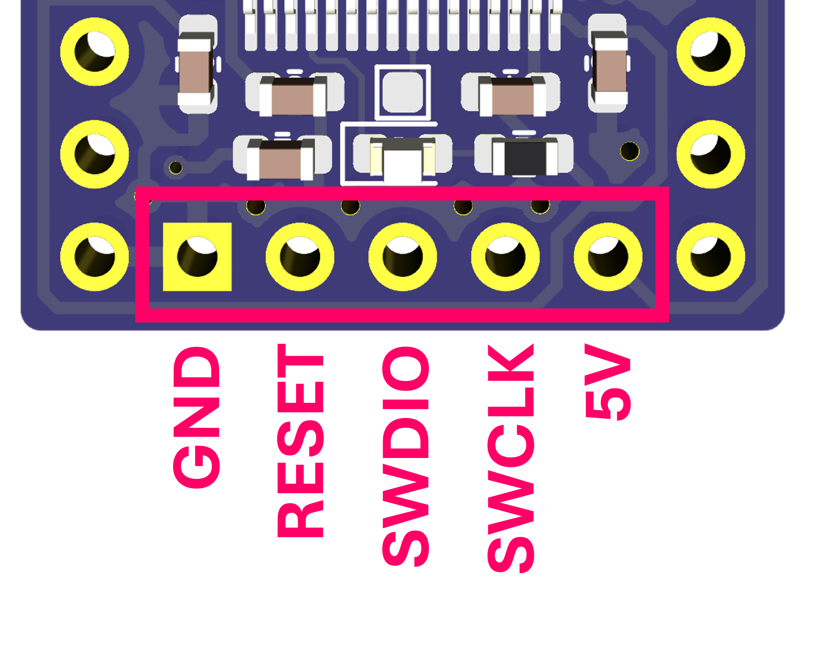

### STM32 Rev G and RP2350 Rev A Programming Pins

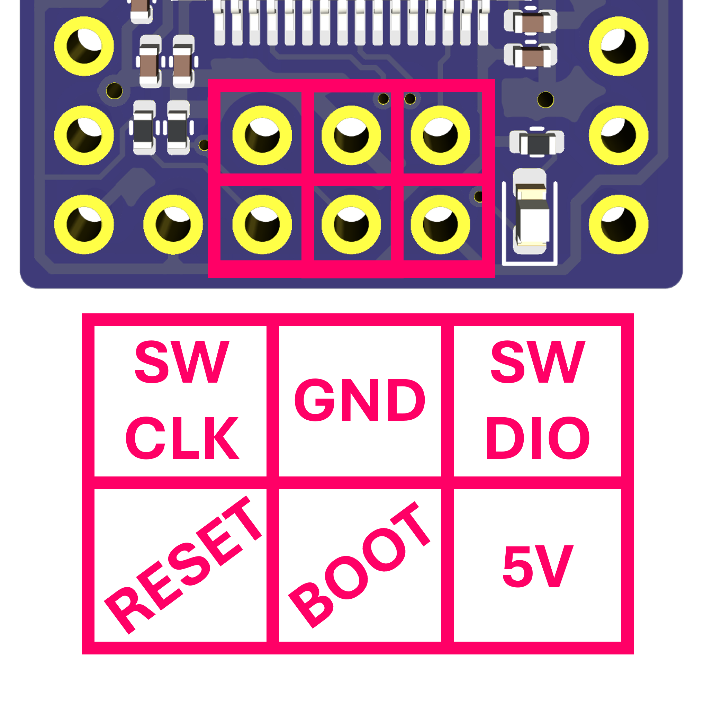

### External Power

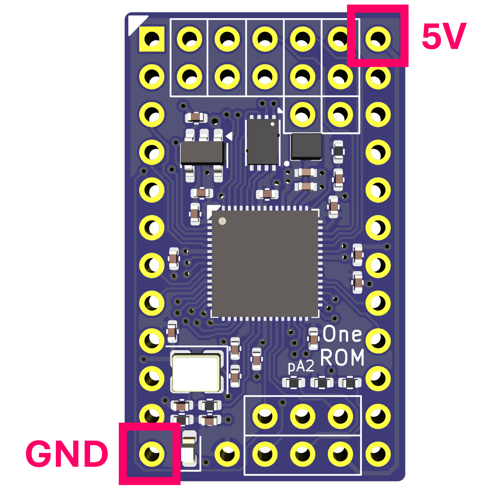

## Image Selection

One ROM supports a number of different ROM images being installed at once, with those images being selected by using the One ROM jumpers.  One ROM reads these jumpers at boot time to detect which image to serve.  Using this mechanism, One ROM will not dynamically switch between images while the retro system is running - see [Bank Selection](#bank-selection) below for dynamic switching.

The image select jumpers are always found at the top of the One ROM PCB, and differerent hardware revisions have different numbers of supported jumpers.

The images below show which jumper indicates which bit of the image selection value.  If closed, the bit is a 1, if open, the bit is a 0.  Therefore to select:
- image 0, leave all jumpers open
- image 1, close the jumper marked 0
- image 2, close the jumper marked 1
- image 3, close the jumpers marked 1 and 0
- etc.

If you select an image number higher than the total number of images installed, One ROM will start counting again from image 0.  For example:
- if you have 1 image installed, it will always be selected
- if you have 2 images installed, only bit 0 will take effect
- if you have 3 images installed and close jumper bits 1 and 0, image 0 will be selected (3 modulo 3 = 0)

### STM32 Revision 24-D Image Selection Jumpers

Revision D has 3 image select jumpers, with the least significant bit on the left.

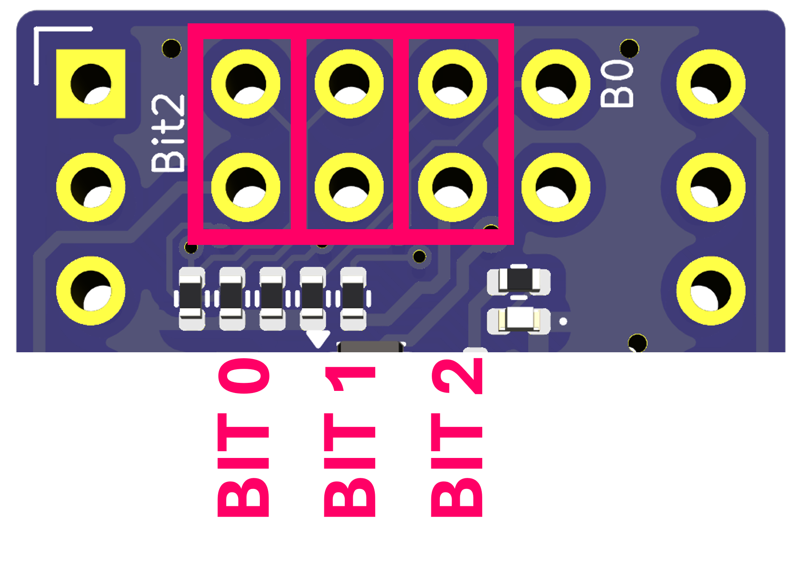

### STM32 Revisions 24-E/F Image Selection Jumpers

Revisions E and F have 4 image select jumpers, with the least significant bit on the left.

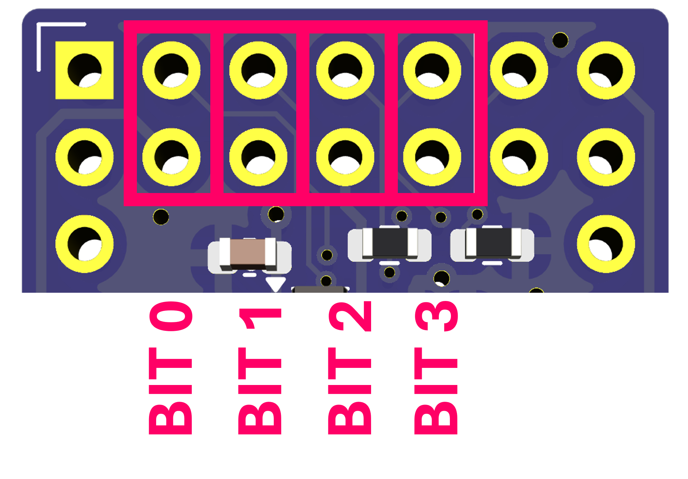

### STM32 Revision 24-G/H Image Selection Jumpers

Revision G has 5 image select jumpers, with the least significant bit on the **right**.

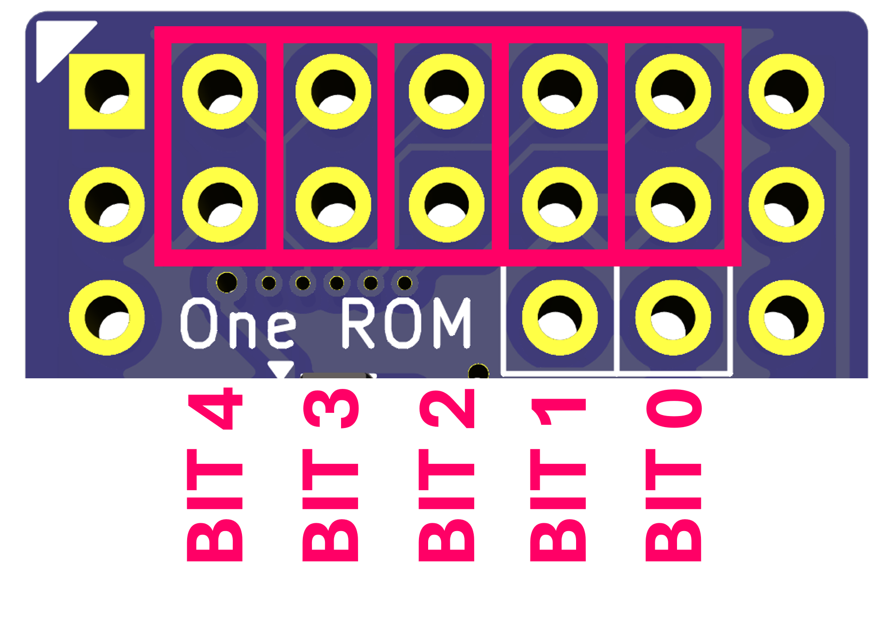

### RP2350 Revision A Image Selection Jumpers

Revision A has 3 image select jumpers, with the least significant bit on the **right**.

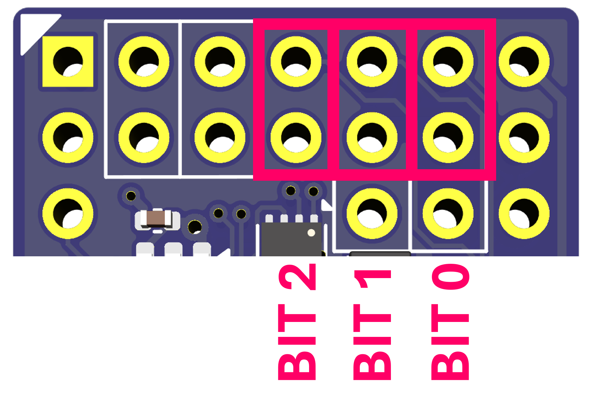

## Bank Selection

When using [bank switched configurations](/docs/MULTI-ROM-SETS.md#dynamic-bank-switching-configuration) (those that start `bank-`), One ROM dynamically switches between images using the bank select jumpers X1 and X2.  These are always found at the top of the PCB.

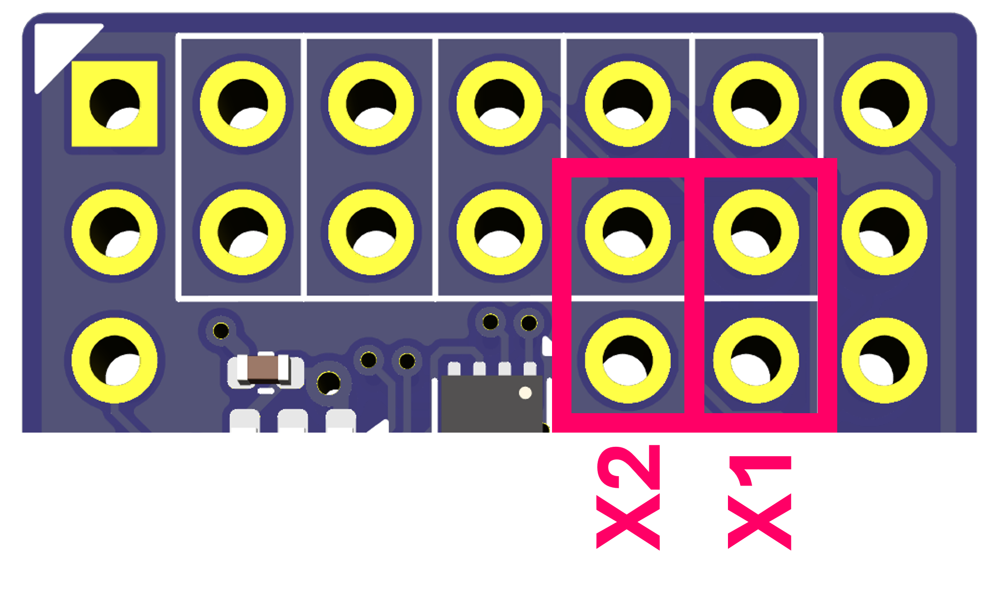

See the [Multi-ROM Sets](/docs/MULTI-ROM-SETS.md) documentation for more information on banks and multi-ROM sets.

## Multi-ROM Sets

When using [multi-ROM sets](/docs/MULTI-ROM-SETS.md#multi-rom-set-configuration) (those that start `set-`), One ROM serves ROM images up to 3 ROM sockets simultaneously, using pins X1 and X2 as extra chip select lines.  Connect flying leads from the X1 and X2 pins to the chip select pins of the other ROM sockets to be served.


See the [Multi-ROM Sets](/docs/MULTI-ROM-SETS.md) documentation for more information on banks and multi-ROM sets.

## Hardware Version Build Settings

When building the One ROM firmware you must identify the hardware version and the MCU type to the build system.  The following table lists the identifiers to use for each hardware version:

| PCB Revision ID | MCU | `HW_REV=` | Supported `MCU=` | `STATUS_LED=` |
|-----------------|-----|-----------|------------------|---------------|
| D | STM32 | 24-d | f401rb/f401rc/f401re/f405rg/f411rc/f411re/f446rc/f446re | Not supported
| E | STM32 | 24-e | f401rb/f401rc/f401re/f405rg/f411rc/f411re/f446rc/f446re | 0/1 |
| F/F2 | STM32 | 24-f | f401rb/f401rc/f401re/f405rg/f411rc/f411re/f446rc/f446re | 0/1 |
| G | STM32 | 24-g | f401rb/f401rc/f401re/f405rg/f411rc/f411re/f446rc/f446re | 0/1 |
| A | RP2350 | p24-a | rp2350 | 0/1 |

## Recovering a Bricked Device

If your programmer will not connect to your One ROM device, or you have accidentally flashed incorrect firmware, you may have bricked your device and need to recover the device by forcing it into DFU/bootloader mode and then programming it using your SWD programmer as normal.

To enter DFU/bootloader mode, you must set the BOOT0 (or BOOT on RP2350) pin to the correct level, and then reset the device, either by power cycling, or briefly pulling the RESET/RUN pin low.

### STM32

On revisions D, E, and F, BOOT0 and 3.3V are exposed at the top right of the board as shown - short the two indicated pins together to pull BOOT0 high.

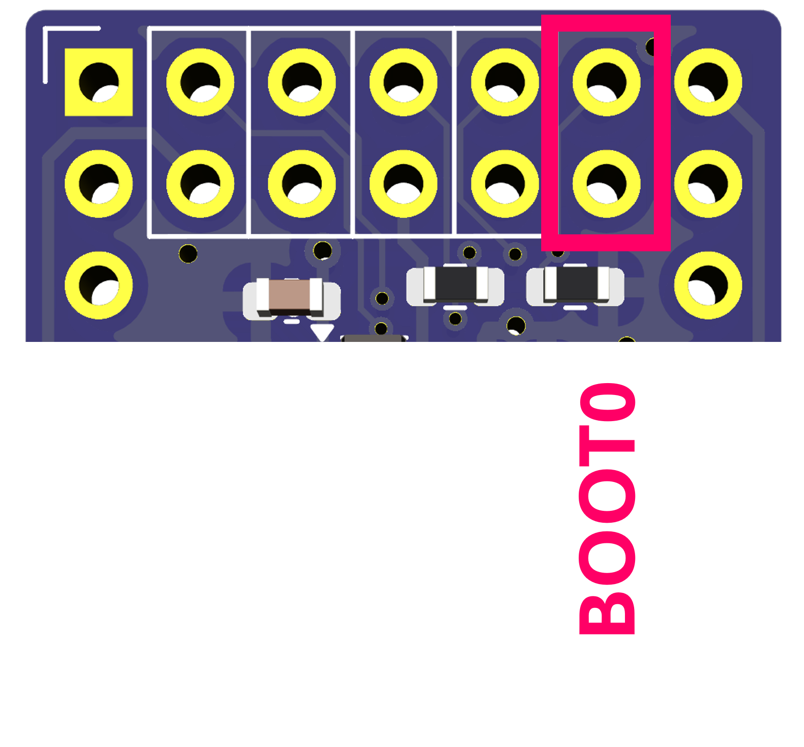

On revision G, BOOT0 and 3.3V are exposed at the bottom of the board as part of the programming pins, as shown.  Short the two indicated pins together to pull BOOT0 high.

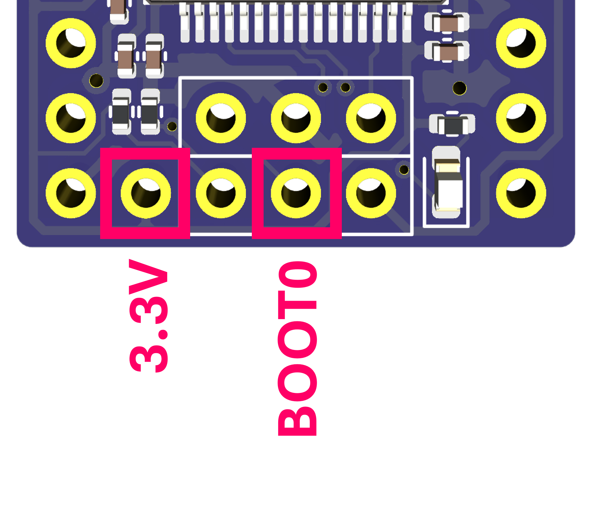

## RP2350

On the RP2350 BOOT must be pulled to GND, while resetting the device, to enter DFU/bootloader mode.  Short the two indicated pins together to pull BOOT low.

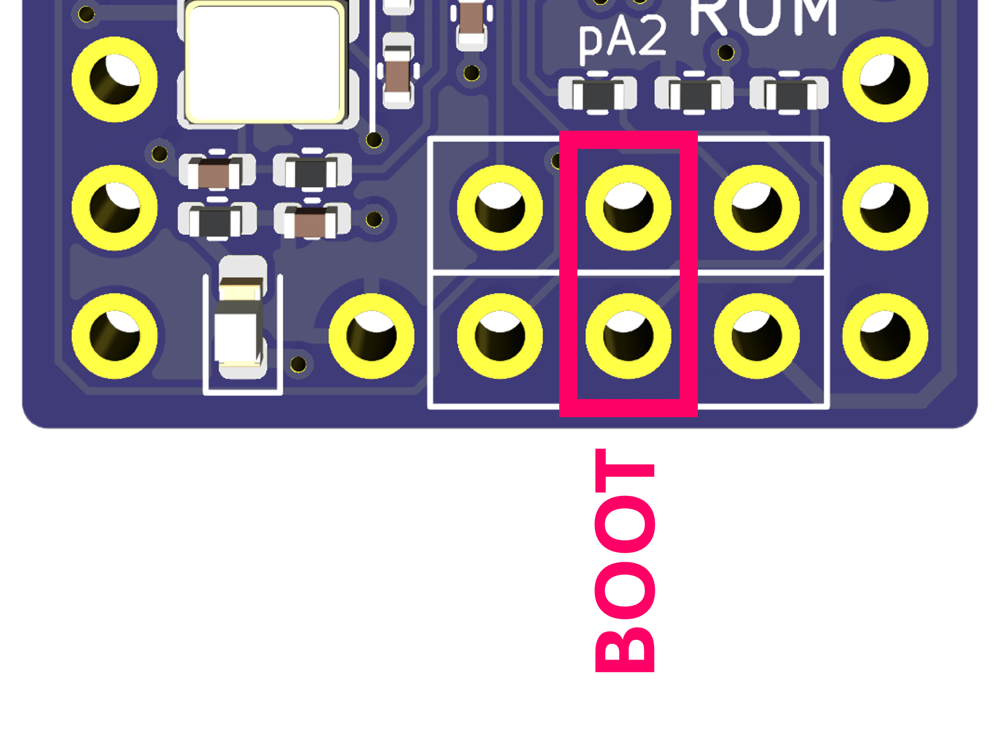
