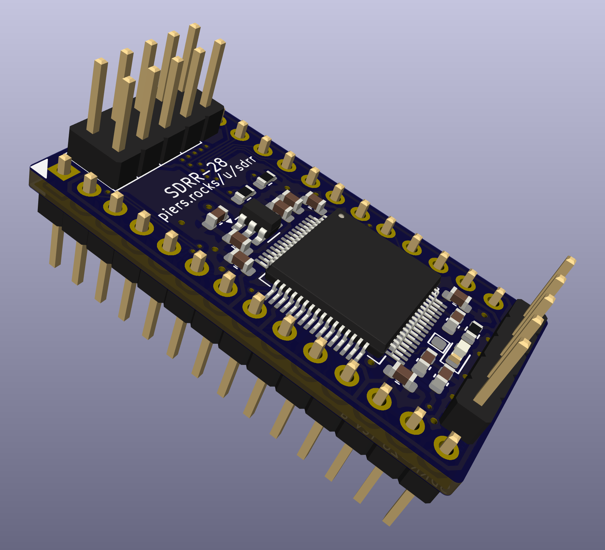

# STM32F4 28 Pin Revision A

**Likely to be rejected** - This first 28 pin prototype does work, but is likely to be replaced by a later revision, and support for this revision may be removed in a future release.

**Unverified** - this revision has not yet been tested or confirmed to work.  Order PCBs at your own risk.

23xxx (STM32F4 28 pin) ROM replacement SDRR PCB.

This PCB is designed to replace 23128s, and possibly 23256/23512s, in the later C64s, 1541C, 1541-II, etc, that use this 16KB+, 28 pin ROMs.

This was dervied from the 24-pin SDRR rev E PCB.

  

## Contents

- [Schematic](sdrr-28-pin-rev-a-schematic.pdf)
- [Fab Notes](sdrr-28-pin-rev-a-fab-notes.pdf)
- [Gerbers](gerbers/) - unverified
- [Ordering Bare PCBs](#ordering-bare-pcbs)
- [Errata](#errata)
- [Notes](#notes)
- [Changelog](#changelog)
- [BOM](#bom)

## Ordering Bare PCBs

## Errata

None

## Notes

None

## Changelog

Changes vs 24-pin rev E:

- Changed output footprint to 23128 (28-pin)
- Moved CE/OE out of PC0-14, to avoid requiring more than 16K for each ROM image
- Added A14/A15 (27C256/512) to PA
- Moved CS/OE extra pins, plus A14/15 to PB0-3
- Moved SEL0-2 to PB4-6 (SEL3 = PB7)
- Switched to AP2112K-3.3 voltage regular in schematic

## BOM

See notes for STM32F405/F415 BOM differences.

| Reference | Component Type | Value | Package | Quantity | Notes |
|-----------|----------------|-------|---------|----------|-------|
| C1, C2 | Capacitor | 1uF | 0603 | 2 | |
| C3 | Capacitor | 4.7uF| 0603 | 1 | |
| C4, C5, C6, C7, C8 | Capacitor | 100nF | 0603 | 5 | |
| C9 | Capacitor | 4.7uF| 0603 | 1 | **F405/F411 - DNP** |
| D1 | LED | - | 0603 | 1 | Optional, colour as desired |
| J1 | Pin header | 1x5 | - | 1 | 2.54mm (0.1") pin pitch |
| J2 | Pin header | 2x4 | - | 1 | 2.54mm (0.1") pin pitch |
| R1, R2 | Resistor | 4k7 | 0603 | 2 | |
| R3 | Resistor | 470R | 0603 | 1 | Optional, modify value to suit chosen LED |
| RC4, RC5 | Resistor | 0R | 0603 | 2 | **F405/F411 - use 2.2uF 0603 capacitor** |
| TP1 | Test point (DNP) | - | - | 1 | Exposes MCO1, configurable via software |
| U1 | Microcontroller | STM32F401RxT STM32F411RxT STM32F405RxT STM32F411RxT | - | 1 | |
| U2 | Pin header | 1x12 | - | 2 | 2.54mm (0.1") pin pitch |
| U3 | Voltage regulator | AP2112K-3.3 | SOT-23-5 | 1 | |
