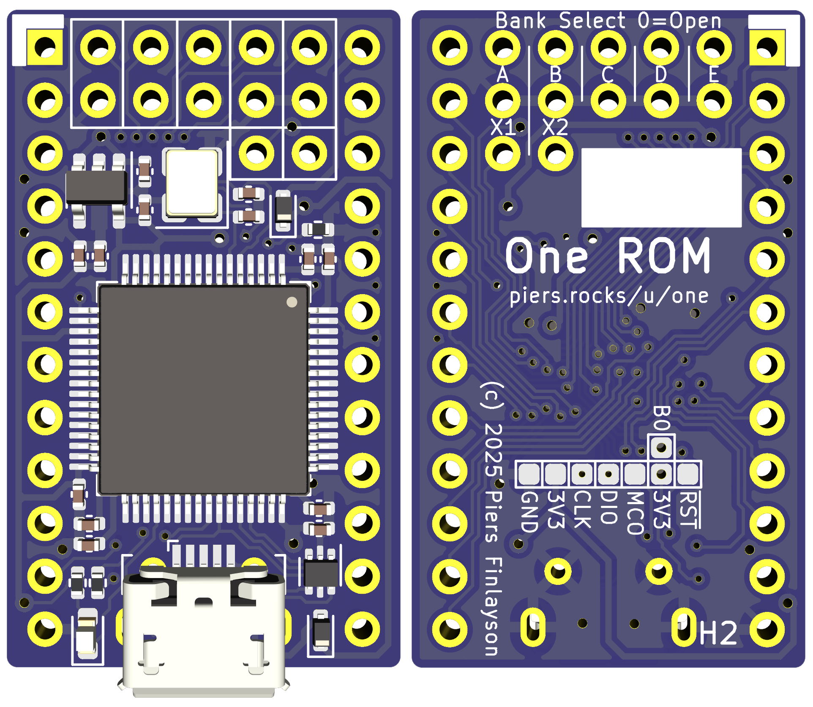

# One ROM Ice USB H2 24 Pin 

**Unverified**: Essentially identical electrically to H.

Very similar to [rev H](../stm32f4-24-pin-rev-h/README.md) but with the following changes:
- Slight re-arrangement of test pads on underside.
- Addition of vias in some of the test pads.

There is a single set of gerbers, one CPL/POS file and one BOM file for the STM32F411RET6 MCU.

To create the BOM for an alternate MCU, replace the microcontroller part number.  For the STM32F405RET6, you must also replace RC4/RC5/C9 - see the schematic for details.

  

## Contents

- [Schematic](stm32f4-24-pin-rev-h2-schematic.pdf)
- [Fab Files](fab/)
- [KiCad Design Files](kicad/)
- [Errata](#errata)
- [Notes](#notes)
- [Changelog](#changelog)
- [BOM](#bom)

## Errata

## Notes

## Changelog

See above

## BOM

See fab files.