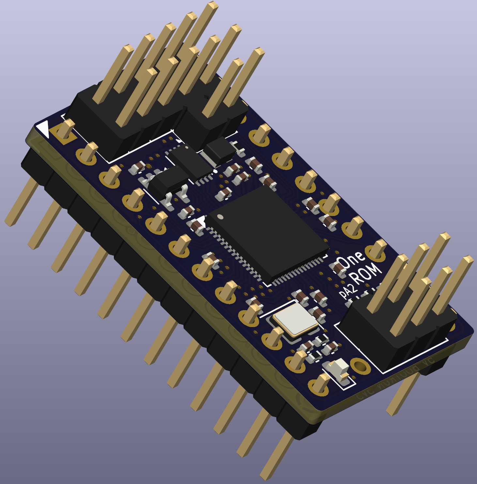

# RP2350 24 Pin Rev A

23xx (RP2350 24 pin) ROM replacement SDRR PCB.

**Verified** - The BOM/CPL files have been verified using JLCPCB.  However, you should always check the gerbers, component lists and component orientations with your supplier before ordering.

This is the first RP2350 revision, supported by v0.4.0 of the firmware.  While testing of all main features has been performed, this hardware design is less mature than the STM32F4 designs.

  

## Contents

- [Schematic](one-rom-24-pin-rp2350-rev-a-schematic.pdf)
- [Fab Notes](one-rom-24-pin-rp2350-rev-a-fab-notes.pdf)
- [Fab Files](fab/)
- [KiCad Design Files](kicad/)
- [Errata](#errata)
- [Notes](#notes)
- [Changelog](#changelog)

## Errata

None

## Notes

None

## Changelog

First revison
