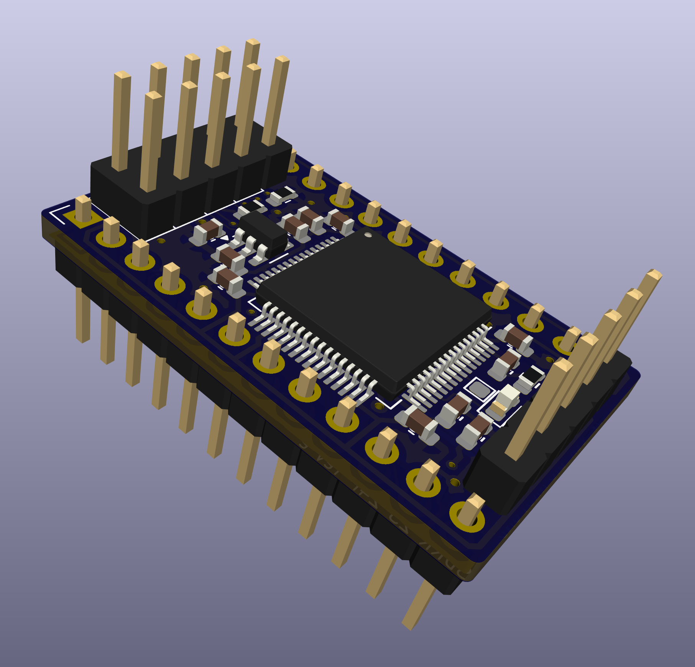

# STM32F4 24 Pin Rev E

23xx (STM32F4 24 pin) ROM replacement SDRR PCB.

This revision has four key improvements over rev D:

- STM32F405 and STM32F415 variants are now supported - note there are some BOM differences between the F401/F411 and F405/F415 variants.  (F415 has not been tested, but is pin compatible with the F405 which has been.)
- No 0402 passives are used - all passives are 0603, which is easier to hand solder.  The PCB footprint remains the same.
- Additional image select jumper (4th jumper => allows up to 16 images/sets to be selected).
- Status LED.

  

## Contents

- [Schematic](sdrr-rev-e-schematic.pdf)
- [Fab Notes](sdrr-rev-e-fab-notes.pdf)
- [Gerbers](gerbers/) - unverified
- [Ordering Bare PCBs](#ordering-bare-pcbs)
- [Errata](#errata)
- [Notes](#notes)
- [Changelog](#changelog)
- [BOM](#bom)

## Ordering Bare PCBs

## Errata

All corrections have been reflected in the BOM below, but not the schematic or gerbers.

- **U3** recommend using AP2112K-3.3 in place of the RT9013, to reduce switching noise, which can cause failure to boot on some systems.

## Notes

- **F401/411/446 vs F405/F415 have slightly different [BOMs](#bom)**
- Now supports STM32F405 and STM32F415 variants, in addition to the STM32F401 and STM32F411 variants.
- Includes [status LED](/docs/CONFIGURATION.md#status_led).
- All passives are 0603, making it easier to hand solder.

## Changelog

- Consolidated and improved 401/411 vs 405/415 support - all variants are supported on the same board with minimal component changes required between variants.
- All passives are 0603.
- Renumbered components.
- Corrected VCAP_1 value for F401/F411 to 4.7uF (2.2uF causes F411 to lock up at 100MHz).
- Removed pull-downs on image select pins, to reduce component count (device uses internal pull-downs).
- Power LED replaced with status LED driven by PB15.
- Added 4th image select jumper (PB7), allowing up to 16 images to be selected.
- Limited silk-screen markings are provided.

## BOM

See notes for STM32F405/F415 BOM differences.

| Reference | Component Type | Value | Package | Quantity | Notes |
|-----------|----------------|-------|---------|----------|-------|
| C1, C2 | Capacitor | 1uF | 0603 | 2 | |
| C3 | Capacitor | 4.7uF| 0603 | 1 | |
| C4, C5, C6, C7, C8 | Capacitor | 100nF | 0603 | 5 | |
| C9 | Capacitor | 4.7uF| 0603 | 1 | **F405/F411 - DNP** |
| D1 | LED | - | 0603 | 1 | Optional, colour as desired |
| J1 | Pin header | 1x5 | - | 1 | 2.54mm (0.1") pin pitch |
| J2 | Pin header | 2x4 | - | 1 | 2.54mm (0.1") pin pitch |
| R1, R2 | Resistor | 4k7 | 0603 | 2 | |
| R3 | Resistor | 470R | 0603 | 1 | Optional, modify value to suit chosen LED |
| RC4, RC5 | Resistor | 0R | 0603 | 2 | **F405/F411 - use 2.2uF 0603 capacitor** |
| TP1 | Test point (DNP) | - | - | 1 | Exposes MCO1, configurable via software |
| U1 | Microcontroller | STM32F401RxT STM32F411RxT STM32F405RxT STM32F411RxT | - | 1 | |
| U2 | Pin header | 1x12 | - | 2 | 2.54mm (0.1") pin pitch |
| U3 | Voltage regulator | AP2112K-3.3 | SOT-23-5 | 1 | |
