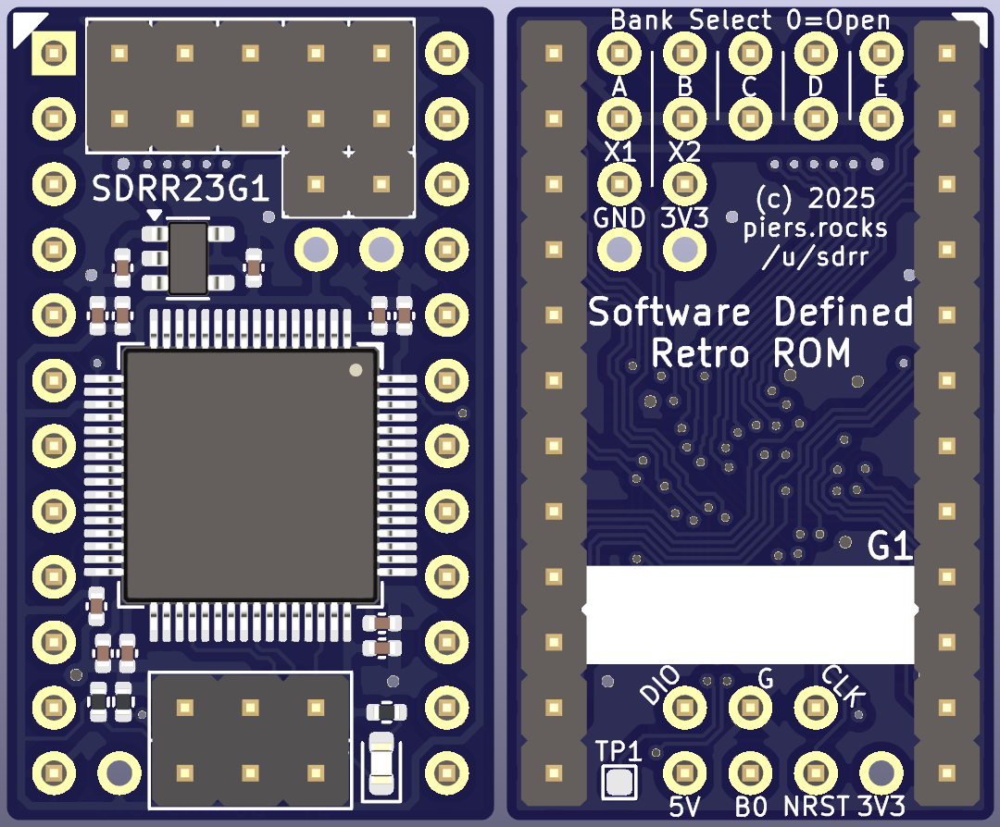

# STM32F4 24 Pin Rev G

One ROM 23xx (STM32F4 24 pin) ROM replacement PCB.

**Partially Verified**: Has been verified with STM32F411.  Has not been verified with STM32F405 (although electrically very similar to rev F so highly likely to work).

Electrically similar to the [STM32F4 24 Pin Rev F2](../../verified/stm32f4-24-pin-rev-f2/README.md) board, but with some minor changes to layout:
- A new 2x3 programming header is on the bottom of the PCB - between pins 12 and 13.  This provides compatibility with the 1x3 SWD header on the Pico/Pico 2s.
  - As part of this BOOT0 has been moved to this header.
- A 5th image select jumper has been added to the top of the PCB, in plact of BOOT0. It is expected that this wil be used for other purposes other than image selection - such as host reset line, driven by an attached co-processor, such as Airfrog.
- The 5 image select jumpers have been relaballed A-E, and in the reverse order to the F2 board - with the intent that the least significant bit is now on the right.
- Closing the jumpers now pulls the image select line low, rather than high.  This is to expose GND rather than 3V3 on the unconnected pin, which is safer.
- An additional 3V3 and GND pair of pins has been added below X1/X2.  This can be used to power the board for progamming, instead of 5V on the programming header, or to tap a 3V3 source from the on-board regulator.  Care should be taken not to overload this.
- An additional single 3V3 pin has been added to the left of the programming header, for similar reasons.
- The MCO1 (optional clock output) test point has been moved to the underside of the PCB, and is now labelled TP1.
- The status LED has been moved to to next to the programming header, to avoid a daughterboard obscuring it.
- Moved to 0402 passives, with the expectation that most people will use an assembly service, and with a microscope and a decent iron, 0402 is also hand solderable.

There is a single set of gerbers, one CPL/POS file and multiple BOM files, one for each of the following F4xx microcontrollers, in ascending order of cost:
- STM32F401RET6
- STM32F411RET6
- GD32F405RGT6
- STM32F405RGT6
- STM32F446RET6

  

## Contents

- [Schematic](sdrr-24-pin-rev-g1-schematic.pdf)
- [Fab Files](fab/)
- [KiCad Design Files](kicad/)
- [Errata](#errata)
- [Notes](#notes)
- [Changelog](#changelog)
- [BOM](#bom)

## Errata

## Notes

## Changelog

See above

## BOM

See fab files.