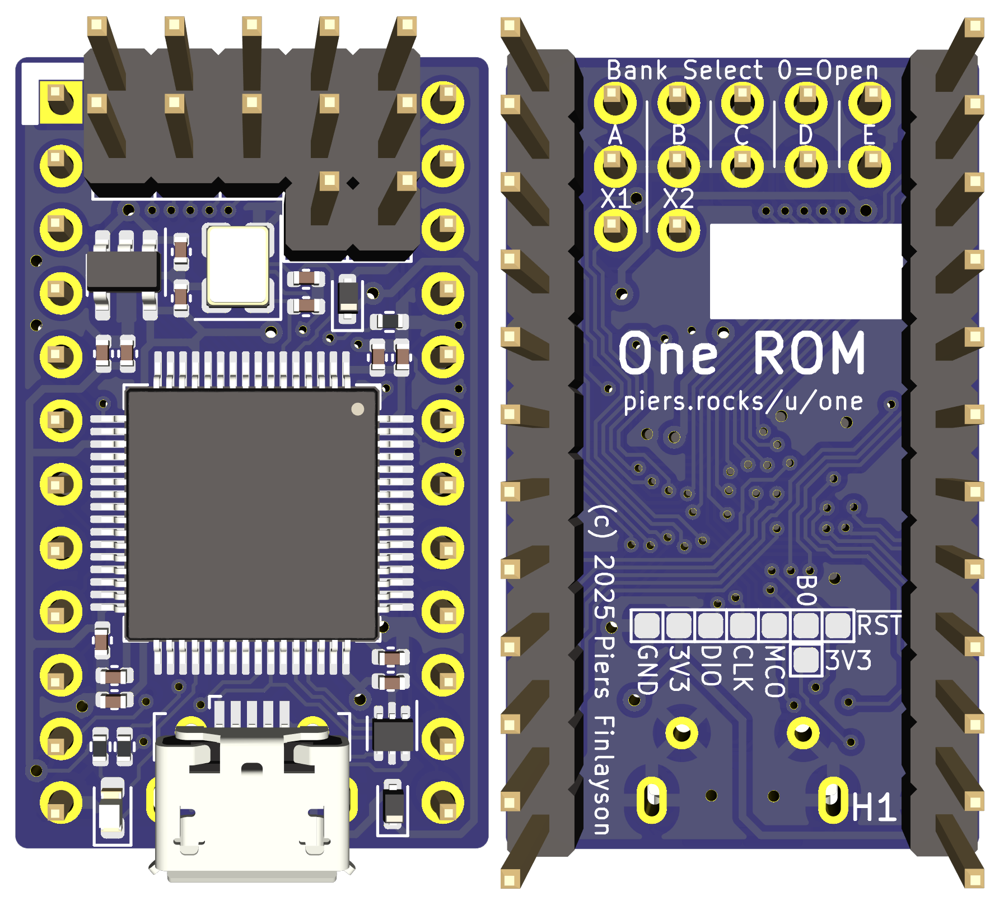

# STM32F4 24 Pin Rev H

One ROM 23xx (STM32F4 24 pin) ROM replacement PCB - USB

**Partially Verified**: Has been verified with STM32F446.  Has not been verified with STM32F405 (although electrically very similar to revs F/G so highly likely to work).

Key changes from [STM32F4 24 Pin Rev G](../../verified/stm32f4-24-pin-rev-g/README.md):
- Programming header replaced by micro USB connector.
- Includes external crystal, so USB timings are spec compliant.
- Includes ESD diodes on USB data lines.
- Includes schottky diodes to allow device to be connected to host and USB simultaneously, without either power source backfeeding the other.
- Pins from rev G programming header are broken out as test points on the underside of the PCB.

There is a single set of gerbers, one CPL/POS file and one BOM file for the STM32F446RET6 MCU.

To create the BOM for an alternate MCU, just replace the microcontroller part number.  For the STM32F405RFT6, you must also replace RC4/RC5/C9 - see the schematic for details.

  

## Contents

- [Schematic](sdrr-24-pin-rev-h-schematic.pdf)
- [Fab Files](fab/)
- [KiCad Design Files](kicad/)
- [Errata](#errata)
- [Notes](#notes)
- [Changelog](#changelog)
- [BOM](#bom)

## Errata

## Notes

## Changelog

See above

## BOM

See fab files.