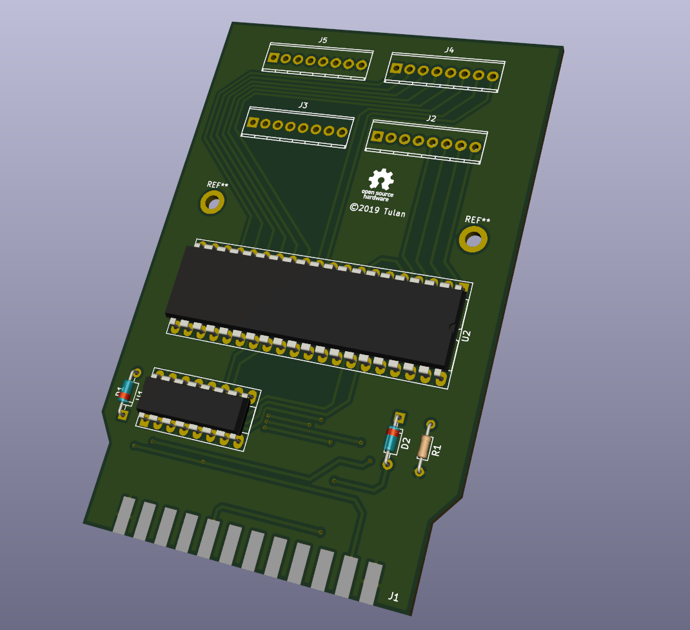
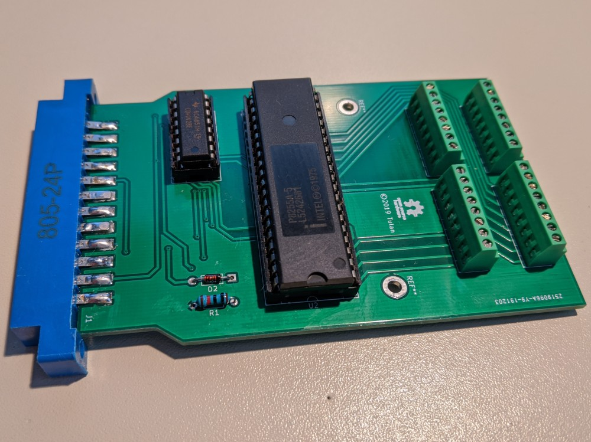

# Userport Expander
C64 Userport Expander is a remake of a project from a "64'er Sonderheft" magazine.

You can find the scan (german language) [here](./docs/UP%2024%20Leitungen_k.pdf).

The driver software can be found [here](./Software/SH67.zip).

The C64 Userport Expander expands the C64 Userport from 8 Bit to 3x8bit.

## 3D Model

## Real Picture

## Layout and PCB
The whole KiCad project is provided inside subfolder ["kicad"](./kicad).

Please feel free to order your own PCBs, Gerber files are here ["gerber"](./kicad/gerber).

I would be pleased about a small donation: [PAYPAL.ME](https://www.paypal.me/RobertGrasboeck)
